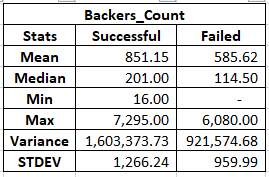

# Excel_homework

Overview

Crowdfunding platforms like Kickstarter and Indiegogo have been growing in success and popularity since the late 2000s. From independent content creators to famous celebrities, more and more people are using crowdfunding to launch new products and generate buzz, but not every project has found success.

To receive funding, the project must meet or exceed an initial goal, so many organizations dedicate considerable resources looking through old projects in an attempt to discover “the trick” to finding success. The goal is to organize and analyze a database of 1,000 sample projects to uncover any hidden trends.

Crowdfunding Table: Category

Using a pivot table, the first table I created was to show a count of how many campaigns were succesful, failed, canceled or currently on-going (live).

Crowdfunding Table: Sub-Category

Using a pivot table, I created a second table to show a count of how many campaigns were succesful, failed, canceled or currently on-going (live) via sub-category.

Crowdfunding O.T.L Pivot-chart line graph

This pivot table is a breakdown of the crowdfunding data by years. The line graph visualizes the data in the table.

For the data above, there is a MS Word document that answers the following questions:

Given the provided data, what are three conclusions that we can draw about crowdfunding campaigns?

What are some limitations of this dataset?

What are some other possible tables and/or graphs that we could create, and what additional value would they provide?

Crowdfunding Goal Analysis

This is table and line chart that graphs the relationship between a goal amount and its chances of success, failure, or cancellation.

Statistical Analysis

I created a summary statistics table to gain an in-depth understanding of campaign backers, evaluate the number of backers of successful and unsuccessful campaigns.

I added a table with the mean, median, minimum, maximum, the variance and standard deviation of the number of backers.

There were two questions to answer:

Would the mean or median be better to summarize the data?

Determine if there is more variability with successful or unsuccessful campaigns?

